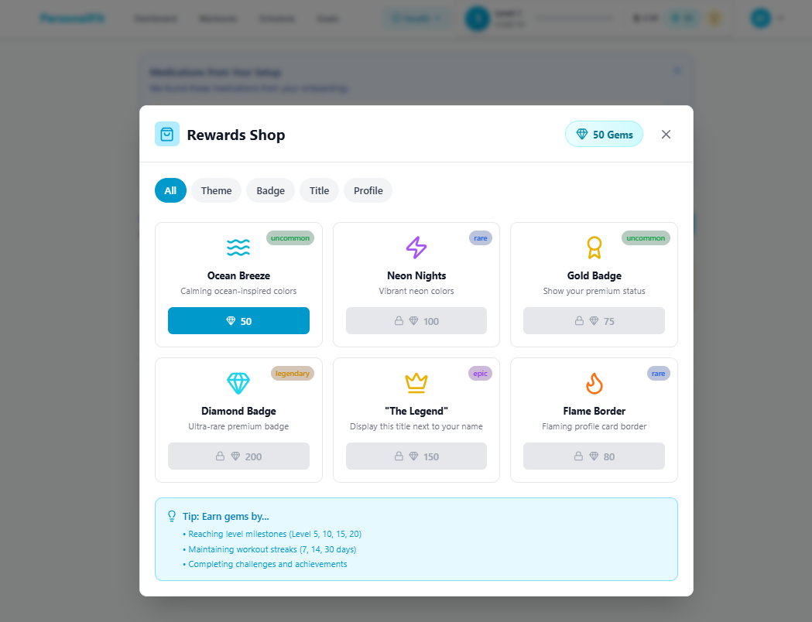
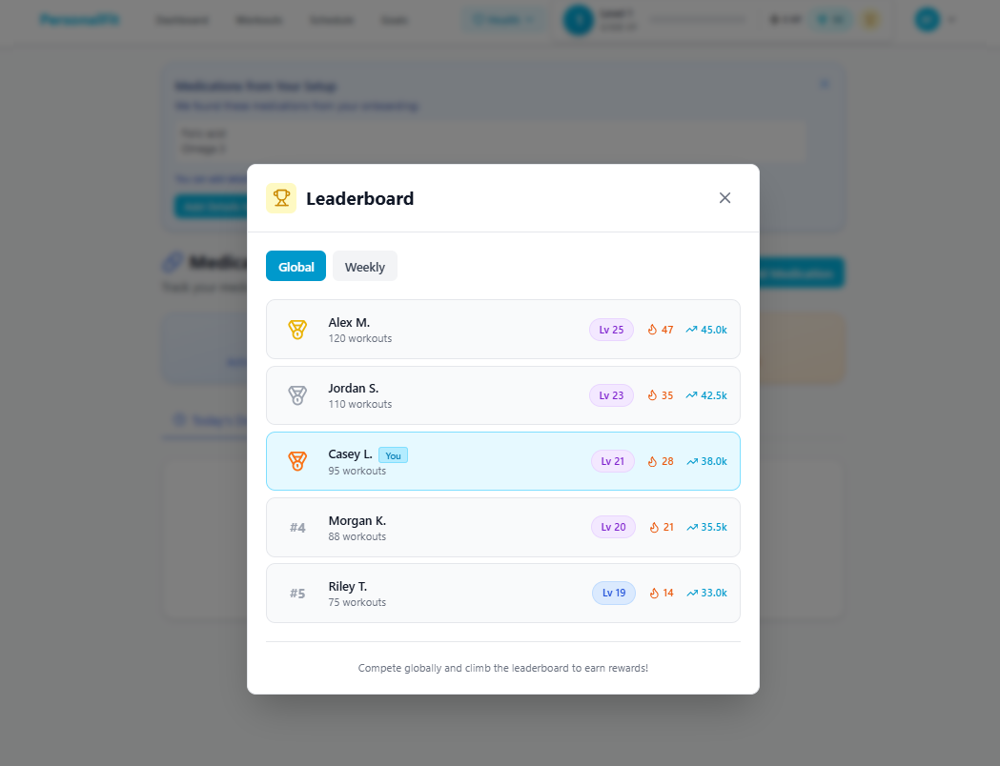

# Lumi ✨

**AI-Powered Health Ecosystem**

Illuminate your health through intelligent insights • Vision AI • Medication tracking • Mental wellness • Habit architecture • Privacy-first

[](https://www.typescriptlang.org/)
[](https://react.dev/)
[](https://expressjs.com/)
[](https://www.mongodb.com/)
[](docker-compose.yml)
[](https://openai.com/)
[](https://www.anthropic.com/)
[](https://ai.google.dev/)
[](LICENSE)

---

## ⚠️ License Notice

> **This software is NOT free for commercial use.**
>
> Lumi is licensed under the **PolyForm Noncommercial License 1.0.0**.
>
> ✅ **Allowed**: Personal use, learning, research, non-profit organizations
> ❌ **Not Allowed**: Commercial use, SaaS integration, reselling
>
> **For commercial licensing, contact:** phillipjuanvanderberg@gmail.com

See the [LICENSE](LICENSE) file for full terms.

---

## 🎯 What is Lumi?

Lumi is an all-in-one health ecosystem that illuminates your path to wellness through AI-powered insights. Combining vision AI (fridge/grocery scanning), medication management, mental wellness tracking, intelligent workout generation, and comprehensive habit architecture — all while keeping your data private on your own server. Lumi brings clarity to your health journey through predictive analytics and proactive guidance.

---

## 📸 Screenshots

**Onboarding Setup**


**Workout Generation & Dashboard**


**Workout Management & Scheduling**


**Medication & Supplement Tracking**


**Gamification & Rewards**





---

## ✨ Key Features

- **🎮 Gamification System** — XP, levels, 42 achievements, daily challenges, streak tracking, leaderboards, rewards shop
- **🤖 Multi-LLM AI Engine** — OpenAI GPT-4o, Anthropic Claude, Google Gemini, Moonshot Kimi — swap providers via config
- **📅 Smart Scheduling** — Visual calendar, weekly preview, progress tracking
- **💪 Workout Management** — Multiple plans, session logging, active plan system
- **� Workout Sharing** — Generate shareable links, public plan preview, one-click import for authenticated users
- **�📊 Progress Tracking** — Body metrics, charts, progress photos with S3 storage
- **💊 Medicine & Supplement Manager** — Track medications, dosages, adherence, health insights, OCR bottle scanning
- **⚙️ Settings Hub** — Notifications, privacy, data management, appearance customization
- **🔐 Privacy-First** — Self-hosted, your data on your server
- **🛡️ Production-Ready** — Rate limiting, security headers, 170+ tests

---

## 🆕 Medicine & Supplement Manager (Complete)

**Phase 1:**
- 📋 Add medications/supplements with dosage, frequency, inventory tracking
- 🏥 Support for prescriptions, OTC, and supplements
- ❤️ Map medications to fitness metrics (heart rate, blood pressure, sleep, energy, etc.)
- ⚠️ Track warnings and contraindications
- 📅 Adherence logging with mood/energy tracking before/after doses
- 🔄 Plan regeneration with medications context in AI prompts
- 🧅 Onboarding integration — collect medications during signup

**Phase 2 (AI Vision & Analytics):**
- 📸 Scan medication bottle labels with camera or photo upload
- 🤖 Claude Vision API for automatic label OCR extraction
- 📊 Confidence scoring for extracted data with manual review/correction flow
- 🔗 Correlation insights dashboard showing medication impact on fitness metrics
- 💡 Smart insights: "Vitamin D appears to improve sleep by 23%"
- 🎯 AI-powered parsing from onboarding notes with batch import
- ✨ Auto-fill medication forms from extracted/parsed data

**Phase 3 (Advanced Gamification & Rewards):**
- 🏆 **Leaderboards** — Global and weekly rankings by XP, streak, level, workout count
- 💎 **Gems Currency** — Earn gems by reaching milestones (levels, streaks)
- 🛍️ **Rewards Shop** — Purchase themes, badges, titles, profile items with gems
- 🎁 **Milestone Rewards** — Auto-claim gems at level 5/10/15/20 or streak 7/14/30 days

---

## 🛠️ Tech Stack

**Backend:** Node.js 22, Express 5.1, TypeScript 5.9, MongoDB 8.x, Jest

**AI Providers:** OpenAI (GPT-4o), Anthropic (Claude 3.5 Sonnet), Google Gemini (1.5 Pro/Flash), Moonshot (Kimi) — pluggable provider architecture with automatic fallback

**Frontend:** React 19, Vite 7, TypeScript 5.9, TailwindCSS 3, Framer Motion, Recharts, Playwright

**Infrastructure:** Docker, Docker Compose, Nginx, MinIO (S3-compatible storage)

---

## 📦 Quick Start

### Prerequisites
- Docker & Docker Compose
- Git
- (Optional) Node.js 22+ for local development

### 1. Clone & Configure

```bash
git clone https://github.com/Poolchaos/Lumi.git
cd Lumi

# Copy environment templates
cp backend/.env.example backend/.env
cp frontend/.env.example frontend/.env
```

### 2. Set Environment Variables

**backend/.env:**
```bash
NODE_ENV=development
PORT=5000
MONGODB_URI=mongodb://mongodb:27017/lumi
JWT_SECRET=your-super-secret-jwt-key
JWT_REFRESH_SECRET=your-refresh-secret
ENCRYPTION_SECRET=your-32-char-encryption-key
CORS_ORIGIN=http://localhost:3000

# Multi-LLM — configure at least one provider
OPENAI_API_KEY=sk-...           # GPT-4o, GPT-4o-mini
ANTHROPIC_API_KEY=sk-ant-...     # Claude 3.5 Sonnet
GEMINI_API_KEY=AI...             # Gemini 1.5 Pro/Flash
MOONSHOT_API_KEY=               # Kimi (optional)
DEFAULT_LLM_PROVIDER=openai     # openai | anthropic | gemini | moonshot
```

**frontend/.env:**
```bash
VITE_API_URL=http://localhost:5000
```

### 3. Launch

```bash
docker-compose up -d
```

### 4. Access

| Service | URL |
|---------|-----|
| 🌐 Web App | http://localhost:3000 |
| 🔌 API | http://localhost:5000 |
| 🗄️ MinIO Console | http://localhost:9003 |

---

## 🧪 Development

### Run Backend Locally
```bash
cd backend
npm install
npm run dev
```

### Run Frontend Locally
```bash
cd frontend
npm install
npm run dev
```

### Run Tests
```bash
# Backend tests
cd backend && npm test

# Frontend E2E tests
cd frontend && npm run test:e2e
```

---

## 📁 Project Structure

```
Lumi/
├── backend/
│   ├── src/
│   │   ├── controllers/     # Route handlers
│   │   ├── models/          # Mongoose schemas
│   │   ├── routes/          # Express routes
│   │   ├── services/        # Business logic
│   │   │   ├── ai/          # AI orchestration layer
│   │   │   └── llm/         # Multi-LLM provider engine
│   │   │       └── providers/ # OpenAI, Anthropic, Gemini, Moonshot
│   │   ├── middleware/      # Auth, rate limiting
│   │   ├── validators/      # Request validation
│   │   └── __tests__/       # Jest tests
│   └── Dockerfile
├── frontend/
│   ├── src/
│   │   ├── pages/           # Route components
│   │   ├── components/      # Reusable UI
│   │   ├── design-system/   # Component library
│   │   ├── hooks/           # Custom React hooks
│   │   ├── api/             # API client & query keys
│   │   ├── store/           # Zustand stores
│   │   └── utils/           # Helpers & validation
│   ├── e2e/                 # Playwright tests
│   └── Dockerfile
├── docs/                    # Documentation
├── docker-compose.yml
└── LICENSE
```

---

## 📜 License

Lumi is licensed under **PolyForm Noncommercial License 1.0.0**.

✅ **Allowed:** Personal use, learning, research, non-profit organizations
❌ **Not Allowed:** Commercial use, SaaS, reselling

**For commercial licensing:** phillipjuanvanderberg@gmail.com

See [LICENSE](LICENSE) for full terms.

---

## 🤝 Contributing

Contributions are welcome! Please note that by contributing, you agree that your contributions will be licensed under the same PolyForm Noncommercial License.

See [CONTRIBUTING.md](CONTRIBUTING.md) for development guidelines.

---

## 🐛 Found a Bug?

If you're using Lumi and encounter any issues, please help us improve by reporting them!

**How to report:**
1. Check if the issue already exists in [GitHub Issues](https://github.com/Poolchaos/Lumi/issues)
2. If not, [create a new issue](https://github.com/Poolchaos/Lumi/issues/new)
3. Include:
   - Steps to reproduce
   - Expected vs actual behavior
   - Your environment (OS, Docker version, browser)
   - Any error messages or screenshots

**Your feedback helps make Lumi better for everyone!**

---

## 📧 Contact

**Phillip-Juan van der Berg**
📧 phillipjuanvanderberg@gmail.com

---

<p align="center">
  <strong>Built with ❤️ for fitness enthusiasts who value privacy</strong>
</p>
